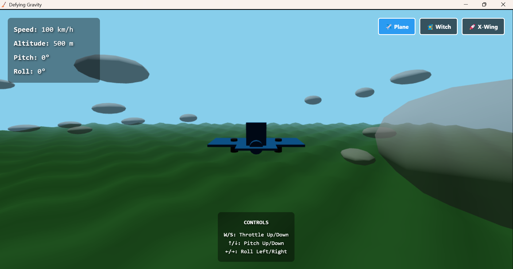
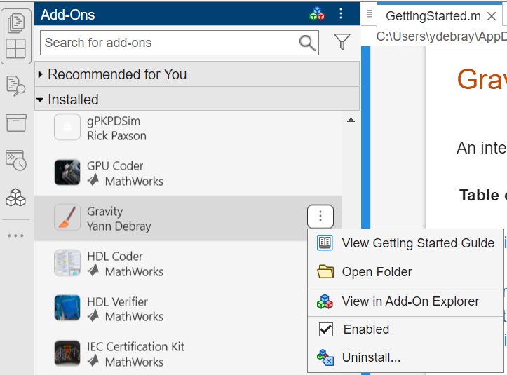

# Embedding a Web App in MATLAB using uihtml

This guide documents how to take a web frontend (HTML/CSS/JavaScript) and embed it into a MATLAB desktop application using the `uihtml` component.



## Prerequisites

- A built web application (e.g., from Vite, React, Vue, etc.) with a `dist/` folder containing:
  - `index.html`
  - `assets/` folder with JS and CSS files
  - Any additional assets (images, icons, etc.)

## Steps

### 1. Build the Web App

If your web app is in a framework like React or Vue, run the build command to generate the production files. For example, with Vite:

```bash
npm run build
```

### 2. Fix Asset Paths for Local Loading

Web builds often use absolute paths (e.g., `/assets/index.js`) that won't work in MATLAB's uihtml. Create a modified HTML file with **relative paths**:

```html
<script src="assets/index.js"></script>
<link href="assets/index.css">
```

Save this as `index.html` in the `dist/` folder.

### 3. Create the MATLAB App

Create `myapp.m` in the project root:

```matlab
function myapp()
    % Create main figure
    fig = uifigure('Name', 'My Web App', ...
                   'Position', [100 100 1200 800], ...
                   'Color', [0 0 0], ...
                   'AutoResizeChildren', 'off');

    % Get path to HTML file
    appDir = fileparts(mfilename('fullpath'));
    htmlFile = fullfile(appDir, 'dist', 'index.html');

    % Create uihtml component filling the figure
    h = uihtml(fig, 'Position', [0 0 fig.Position(3) fig.Position(4)]);
    h.HTMLSource = htmlFile;

    % Handle figure resize
    fig.SizeChangedFcn = @(src, ~) resizeHTML(src, h);

    % Optional: Handle events from JavaScript
    h.HTMLEventReceivedFcn = @(src, event) handleEvent(src, event);
end

function resizeHTML(fig, h)
    h.Position = [0 0 fig.Position(3) fig.Position(4)];
end

function handleEvent(~, event)
    % Handle JavaScript -> MATLAB communication
    eventName = event.HTMLEventName;
    eventData = event.HTMLEventData;
    fprintf('Received: %s\n', eventName);
end
```

### 4. Optional: MATLAB ↔ JavaScript Communication

**JavaScript → MATLAB:**
```javascript
// In your web app
htmlComponent.sendEventToMATLAB("Calculate", {value: 42});
```

**MATLAB → JavaScript:**
```matlab
% Send data to JavaScript
sendEventToHTMLSource(h, 'ResultReady', result);
```

**JavaScript listener:**
```javascript
htmlComponent.addEventListener("ResultReady", function(event) {
    console.log("Result:", event.Data);
});
```

## Optional: Packaging as a MATLAB toolbox




**Install the toolbox:**
```matlab
matlab.addons.install('Gravity.mltbx')
```

**Run the app:**
```matlab
gravityApp
```

### Toolbox Project Structure

```
gravity/
├── apps/                           % MATLAB apps and web source
│   ├── gravityApp.m                % Home screen with navigation
│   ├── gravityFlightSimulator.m    % Interactive flight simulator
│   ├── gravityFlightDashboard.m    % Flight replay dashboard
│   ├── dist/                       % Built web assets
│   │   ├── index.html
│   │   ├── broom.png
│   │   └── assets/
│   ├── src/                        % React/TypeScript source
│   │   ├── main.jsx
│   │   ├── App.jsx
│   │   ├── flight_sim.tsx
│   │   ├── App.css
│   │   └── index.css
│   ├── package.json                % npm dependencies
│   ├── vite.config.js              % Vite build config
│   └── index.html                  % Dev entry point
├── examples/
│   └── GettingStarted.m            % Plain text live script guide
├── img/
│   ├── gravityApp.png              % App screenshot
│   ├── background.png              % Home screen background
│   └── toolbox.png                 % Toolbox packaging screenshot
├── resources/
│   └── toolbox_icon.png            % Toolbox icon
├── Gravity.mltbx            % Installable toolbox package
└── README.md
```

### Key Points

| Issue | Solution |
|-------|----------|
| Absolute paths | Use relative paths in HTML |
| SizeChangedFcn warning | Set AutoResizeChildren to off |
| SVG icon not working | Convert to PNG (uifigure only supports PNG/JPEG/GIF) |
| Toolbox identifier | Use alphanumeric and hyphens only (no dots) |
